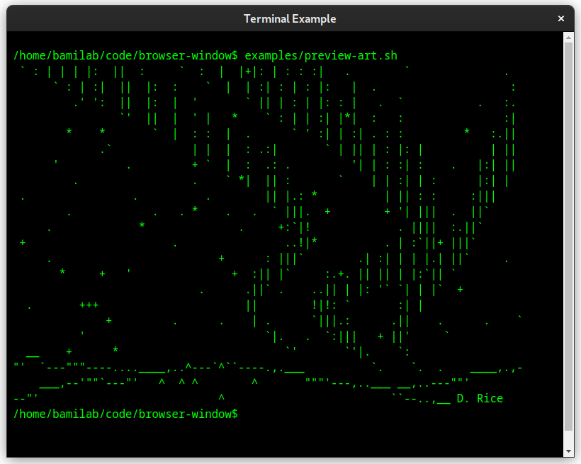

# BrowserWindow

_BrowserWindow_ is a simple Rust crate for utilizing a browser engine to create a graphical user interface.
Just like [Electron.js](https://www.electronjs.org/), you can use it to build a GUI with HTML, CSS & JS, or just to have some basic browser functionality at your disposal.

## Introduction

_BrowserWindow_ is designed to be easy to use, and work cross-platform. It utilizes the async/await
syntax & it even has optional thread-safe handles. There are currently three different underlying
browser frameworks that can be selected: CEF, WebkitGTK or Edge WebView2.
Each framework has their pros and cons, but CEF will be the most feature complete because it has the
best cross-platform support and the browser engine is regularely updated.
However, if you only need some very basic functionality, the other frameworks are easier to set up.

You can look at some [examples](https://github.com/bamilab/browser-window/tree/master/examples) to
get an idea how you can use the api.

## Getting Started

The underlying browser framework does need some things to be set up on your system (although Edge
WebView2 may out-of-the-box on newer Windows installations).
But otherwise there is a [guide](./docs/GETTING-STARTED.md) to get you started with using
_BrowserWindow_ on your system.

## License

This software is available as open source software under a MIT license, for maximum freedom and
minimum restrictions.

## Missing a feature?

At the moment, there is a decent set of basic functionality available, but if you need something
that isn't there yet, please [submit an issue](https://github.com/bamidev/browser-window/issues) for it.